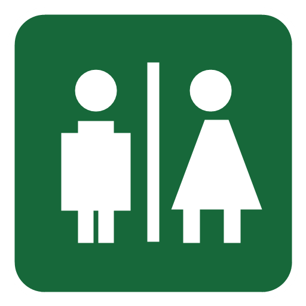
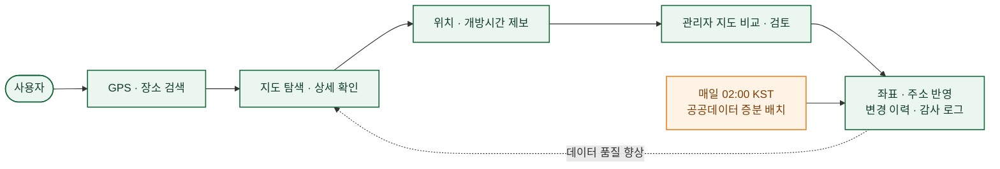

# 급똥

### 급할 때, 내 주변 공중화장실을 가장 빠르게 찾는 지도 서비스

공공데이터와 카카오맵을 연결해 **탐색 → 제보 → 검토 → 데이터 개선**까지 운영하는 위치 기반 서비스입니다.

 

---

## ✨ Project at a Glance

| 🗺️ **FIND** | 📣 **REPORT** | 🛡️ **REVIEW** | 🔄 **IMPROVE** |
| :---: | :---: | :---: | :---: |
| GPS·장소 검색 거리순 화장실 탐색 | Google·Kakao 로그인 위치·개방시간 제보 | 지도 비교·승인 보정 역할·감사 로그 | 매일 증분 동기화 중복 좌표 품질 관리 |

> **위치를 찾는 기능에서 끝나지 않습니다.** 사용자가 발견한 오류를 제보하고, 관리자가 근거를 확인해 반영하며, 변경 이력과 자동 배치 보호 정책으로 데이터가 계속 좋아지는 구조를 만들었습니다.

## 🧭 서비스가 동작하는 방식

## 🧩 Engineering Highlights

| 문제 | 설계·구현 | 결과 |
| --- | --- | --- |
| **넓은 지도 영역의 과도한 마커** | 지도 레벨별 개별 마커·서버 클러스터 전환, 광역 레벨 상세 목록 제한 | 클라이언트 렌더링 부담과 화면 혼잡도 완화 |
| **동일 주소·동일 좌표의 공공데이터** | 동일 좌표 그룹화, 사용자 묶음 표시, 관리자 품질 검토 상태 관리 | 최상단 마커 하나만 선택되는 문제를 사용자·운영 흐름으로 해결 |
| **자동 갱신과 수동 좌표 보정의 충돌** | 좌표 출처와 변경 이력 분리, `ADMIN_CONFIRMED` 보호 정책 | 다음 배치가 검증된 관리자 좌표를 덮어쓰는 회귀 방지 |
| **OAuth와 관리자 기능의 보안 경계** | HttpOnly JWT 쿠키, Redis refresh 해시·TTL, Cloudflare Access + `ADMIN` 역할 | 토큰 원문을 저장하지 않고 공개/사용자/관리자 권한을 계층적으로 분리 |
| **운영 중 데이터 변화 추적** | 증분 배치 이력, 실패 알림, 제보 감사 로그, KST 시간 표준화 | 배포·배치·관리자 행위를 운영 화면과 기록으로 추적 가능 |

## 🏗️ System Architecture · v3.0

  

| 경계 | 구성 | 핵심 책임 |
| --- | --- | --- |
| **Public Edge** | Cloudflare Pages·DNS·Proxy | 사용자 웹 제공, HTTPS, API 진입 |
| **Application** | Nginx, Spring Boot API·Admin, Batch | 공개 조회, OAuth, 제보, 운영·배치 처리 |
| **Data** | MySQL, Redis 7 | 영구 데이터·변경 이력, 만료형 refresh session |
| **Operations** | Cloudflare Access, GitHub Actions, Docker Hub | 관리자 접근 통제, 정적 분석·이미지 빌드·자동 배포 |

## 🗂️ Repository Map

| Repository | Responsibility | Key Topics |
| --- | --- | --- |
| [**toilet-web**](https://github.com/toilet-project/toilet-web) | 사용자 지도 웹 | React, Kakao Maps, 반응형 지도 UX, OAuth·제보·알림 |
| [**toilet-api**](https://github.com/toilet-project/toilet-api) | Public·User·Admin API | Spring Security, OAuth/JWT, JPA, Flyway, 감사 로그 |
| [**toilet-admin-api**](https://github.com/toilet-project/toilet-admin-api) | 관리자 운영 API | 대시보드, 제보·배치·데이터 품질 조회, 서버 페이지네이션 |
| [**toilet-batch**](https://github.com/toilet-project/toilet-batch) | 공공데이터 동기화 | 최근 3일 증분 수집, 카카오 지오코딩, upsert, 실행 이력 |
| [**docs**](https://github.com/toilet-project/docs) | 설계·운영 문서 | 요구사항, API·DB 명세, 아키텍처, 보안·배포 가이드 |

## 🧰 Tech Stack

<table>
  <tr>
    <td width="20%"><b>Client</b></td>
    <td>React · TypeScript · Vite · Kakao Maps JavaScript SDK</td>
  </tr>
  <tr>
    <td><b>Server</b></td>
    <td>Java 21 · Spring Boot · Spring Security · OAuth2 Client/Resource Server · JPA · Flyway</td>
  </tr>
  <tr>
    <td><b>Data</b></td>
    <td>MySQL · Redis 7 · 공공데이터포털 API · Kakao Local API</td>
  </tr>
  <tr>
    <td><b>Infra</b></td>
    <td>Cloudflare Pages/DNS/Access · Nginx · Docker Compose · Mini PC Ubuntu</td>
  </tr>
  <tr>
    <td><b>Delivery</b></td>
    <td>GitHub Actions · CodeQL · Docker Hub · SSH 기반 자동 배포</td>
  </tr>
</table>

## 🔍 Portfolio Focus

| Product & UX | Backend & Data | Security | DevOps & Operations |
| --- | --- | --- | --- |
| 모바일·데스크탑 지도 UX 거리·클러스터·동일 위치 목록 | 증분 수집·지오코딩·upsert 제보·좌표·알림 데이터 모델 | Google·Kakao OAuth JWT·Redis·RBAC·감사 로그 | Cloudflare·Nginx·Docker CI/CD·헬스체크·실패 알림 |

<b>🔐 보안·인증 설계 자세히 보기</b>

 

- 공개 웹·API는 HTTPS만 사용하고, 관리자 영역은 Cloudflare Access와 애플리케이션 `ADMIN` 역할로 이중 보호합니다.
- Access JWT는 HttpOnly·Secure 쿠키로 전달하고, refresh token 원문 대신 SHA-256 해시와 TTL을 Redis에 저장합니다.
- MySQL·Redis·Batch는 Docker 내부 네트워크에서만 통신하며 외부 포트를 노출하지 않습니다.
- OAuth token, DB 비밀번호, 외부 API 키와 개인정보는 문서·소스·감사 로그에 기록하지 않습니다.

<b>⚙️ 데이터·운영 정책 자세히 보기</b>

 

- 배치는 매일 02:00 KST에 최근 3일 갱신분을 수집하고 신규·수정·실패 건수를 이력으로 남깁니다.
- 스키마 변경은 Flyway migration으로 적용하며 애플리케이션 업무 시각은 `Asia/Seoul` 기준으로 저장·표시합니다.
- 사용자 위치 제보 승인과 관리자 직접 보정은 변경 전후 좌표·주소를 보존하고 감사 로그와 연결합니다.
- 이름만 보고 좌표를 자동 추정하지 않으며, 관리자가 근거를 확인한 좌표만 확정 데이터로 반영합니다.

## 📚 Documentation

| Architecture & API | Data & Security | Operations |
| --- | --- | --- |
| [운영 아키텍처 v3.0](https://github.com/toilet-project/docs/blob/main/architecture/architecture-v3.md) [REST API 명세](https://github.com/toilet-project/docs/blob/main/api/toilet-api.md) | [운영 데이터 모델 v1.6](https://github.com/toilet-project/docs/blob/main/database/database-schema-v1.6.md) [인증·권한 정책](https://github.com/toilet-project/docs/blob/main/planning/authentication-authorization-design.md) [중복 좌표 품질 관리](https://github.com/toilet-project/docs/blob/main/database/duplicate-coordinate-quality.md) | [배포·운영 가이드](https://github.com/toilet-project/docs/blob/main/operations/deployment.md) [문서 변경 이력](https://github.com/toilet-project/docs/blob/main/changelog/CHANGELOG.md) [Organization WBS](https://github.com/orgs/toilet-project/projects/2/views/1) |

---

### **Find fast. Report clearly. Improve continuously.**

급똥은 지도 검색 기능을 넘어, **사용자 참여와 운영 검증으로 공공데이터의 품질을 개선하는 서비스**를 지향합니다.

