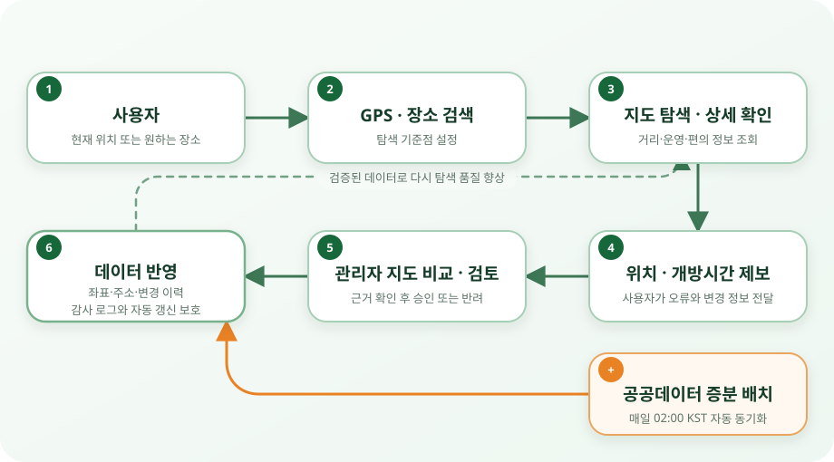

# 급똥

### 급할 때, 내 주변 공중화장실을 가장 빠르게 찾는 지도 서비스

공공데이터와 카카오맵을 연결해 **탐색 · 현장 리뷰 · 제보 · 관리자 검토**까지 운영하는 위치 기반 서비스입니다.

 

---

## ✨ Project at a Glance

<table>
  <tr>
    <th width="25%">🗺️ FIND</th>
    <th width="25%">⭐ SHARE</th>
    <th width="25%">🛡️ VERIFY</th>
    <th width="25%">🔄 IMPROVE</th>
  </tr>
  <tr align="center">
    <td>GPS·장소 거리·상세</td>
    <td>현장 리뷰 정보 제보</td>
    <td>변경 비교 중복 정리</td>
    <td>확정 보호 캐시 갱신</td>
  </tr>
</table>

> **위치를 찾는 기능에서 끝나지 않습니다.** 사용자가 발견한 오류를 제보하고, 관리자가 근거를 확인해 반영하며, 변경 이력과 자동 배치 보호 정책으로 데이터가 계속 좋아지는 구조를 만들었습니다.

운영 기준: 2026-09-17 · [현재 기능과 확인 범위](https://github.com/toilet-project/docs/blob/main/operations/current-state-2026-09-17.md)

## 🧭 서비스가 동작하는 방식

  

**리뷰는 별도의 참여 흐름입니다.** 로그인 → 모바일 위치 조건 확인 → 작성 → 내 리뷰 관리로 이어집니다. 시설 정보를 바꾸는 제보·공공데이터 후보만 관리자 검토 흐름과 연결합니다.

## 🧩 Engineering Highlights

| 해결할 문제 | 설계·구현 | 얻은 효과 |
| --- | --- | --- |
| **넓은 지도와 겹치는 마커** | 지도 레벨별 서버 클러스터·동일 위치 묶음, 상세 목록 분리 | 지도 혼잡과 렌더링 부담 완화 |
| **같은 이름이라고 같은 시설은 아님** | 이름·좌표·지역구 비교, 전체 순번 지도, 대표 지정·선택 숨김 | 원본과 이력을 보존하며 공개 중복 정리 |
| **배치가 관리자 보정을 덮어쓰는 충돌** | 확정 좌표·주소 보호, 변경 후보·수신 증빙 분리, 관리자 결정 | 자동 갱신과 수동 판단의 책임 분리 |
| **리뷰의 중복 작성과 변경 경쟁** | 서버 거리·시각 검사, 시설별 24시간 제한, 멱등성·소유권·7일 기한 검증 | UI 안내뿐 아니라 서버에서 작성·수정 규칙 보장 |
| **배포마다 반복되는 상세 캐시 생성** | 배포 독립 R2 데이터, revision outbox, 28일 순환 갱신·퇴역 캐시 보호 | 전체 페이지 재생성 부담을 줄이고 오래된 데이터 재등장 방지 |
| **외부 분석 의존과 불필요한 수집** | GA 제거, 허용 이벤트·기간 한정 중복 제거·KST 자체 집계 | 운영 지표를 유지하며 저장 항목·보유 기간 직접 통제 |
| **OAuth·관리자 접근·복원 후 파기 정보** | HttpOnly JWT·Redis 해시/TTL, Access + ADMIN, 국내 암호화 보호 기록 | 사용자·운영 권한과 개인정보 처리 경계 분리 |

## 🏗️ System Architecture · v5

  

| 경계 | 구성 | 핵심 책임 |
| --- | --- | --- |
| **Public Edge** | Next.js/OpenNext · Cloudflare Workers | 사용자 웹·상세 페이지 제공 |
| **Cache** | R2 · D1 · Durable Object | 공개 데이터·배포별 페이지 분리, 태그 갱신·재검증 |
| **Application** | Tunnel · Nginx · Spring Boot API/Admin · Batch | 인증·참여·데이터 품질·공공데이터 동기화 |
| **Data** | MySQL · Redis · 국내 LOCAL 보호 기록 | 영구 업무 데이터·만료 세션·파기 재생 방지 |
| **Operations** | Access · GitHub Actions · CodeQL · Docker | 접근 통제·검증·승인된 산출물 반영·백업 점검 |

검사·배포 기록 바로가기 · CI 통과와 실제 운영 반영은 구분합니다.

## 🗂️ Repository Map

| Repository | Responsibility | Key Topics |
| --- | --- | --- |
| [**toilet-web**](https://github.com/toilet-project/toilet-web) | 사용자 지도 웹 | Next.js/OpenNext, 지도·현장 리뷰·내 페이지·알림 |
| [**toilet-api**](https://github.com/toilet-project/toilet-api) | Public·User·Admin API | 인증·리뷰·품질 정책, Flyway, 캐시 outbox, 자체 분석 |
| [**toilet-admin-api**](https://github.com/toilet-project/toilet-admin-api) | 관리자 워크스페이스 | 제보·변경 비교·중복 관리·운영 지표 |
| [**toilet-batch**](https://github.com/toilet-project/toilet-batch) | 공공데이터 동기화 | 증분 수집·지오코딩·확정 값 보호·변경 후보 |
| [**docs**](https://github.com/toilet-project/docs) | 설계·운영 문서 | 요구사항, API·DB 명세, 아키텍처, 보안·배포 가이드 |

## 🧰 Tech Stack

<table>
  <tr>
    <td width="20%"><b>Client</b></td>
    <td>Next.js · React · TypeScript · OpenNext · Kakao Maps JavaScript SDK</td>
  </tr>
  <tr>
    <td><b>Server</b></td>
    <td>Java 21 · Spring Boot · Spring Security · OAuth2 Client/Resource Server · JPA · Flyway</td>
  </tr>
  <tr>
    <td><b>Data</b></td>
    <td>MySQL · Redis 7 · Cloudflare R2/D1 · 공공데이터포털 API · Kakao Local API</td>
  </tr>
  <tr>
    <td><b>Infra</b></td>
    <td>Cloudflare Workers/DNS/Access/Tunnel · Durable Object · Nginx · Docker · Mini PC Ubuntu</td>
  </tr>
  <tr>
    <td><b>Delivery</b></td>
    <td>GitHub Actions · CodeQL · Docker Hub · 검증 산출물·보호 게이트 기반 배포</td>
  </tr>
</table>

## 🔍 Portfolio Focus

| Product & UX | Backend & Data | Security | DevOps & Operations |
| --- | --- | --- | --- |
| 모바일·데스크탑 지도 UX 현장 리뷰·내역·기간 필터 | 변경 후보·숨김 이력 동시성·revision·캐시 일관성 | Google·Kakao OAuth JWT·Redis·RBAC·감사 로그 | Workers·Tunnel·Docker 캐시 수명주기·자체 통계·감시 |

<b>🔐 보안·인증 설계 자세히 보기</b>

 

- 공개 웹·API는 HTTPS만 사용하고, 관리자 영역은 Cloudflare Access와 애플리케이션 `ADMIN` 역할로 이중 보호합니다.
- 애플리케이션 access JWT는 HttpOnly·Secure 쿠키로 전달하고, refresh token 원문 대신 SHA-256 해시와 TTL을 Redis에 저장합니다.
- MySQL·Redis는 공개 인터넷에 노출하지 않습니다. 개인 운영 접속과 배포 접속은 별도 Tunnel 정책으로 구분합니다.
- 비밀값·개인정보는 공개 문서에 싣지 않습니다. 분석 저장소에는 원문 IP·회원 ID·정확한 위치·검색 원문을 보관하지 않습니다.

<b>⚙️ 데이터·운영 정책 자세히 보기</b>

 

- 배치는 매일 02:00 KST에 최근 3일 갱신분을 수집하고 신규·수정·실패 건수를 이력으로 남깁니다.
- 스키마 변경은 Flyway migration으로 적용하며 애플리케이션 업무 시각은 `Asia/Seoul` 기준으로 저장·표시합니다.
- 사용자 위치 제보 승인과 관리자 직접 보정은 변경 전후 좌표·주소를 보존하고 감사 로그와 연결합니다.
- 이름만 보고 동일 시설로 확정하지 않습니다. 숨김 시설의 공공데이터 변경은 당시 근거와 함께 검토하며 자동 공개하지 않습니다.
- 리뷰는 150m 이내·최근 5분 위치·정확도 조건을 서버에서 검사하지만 실제 방문이나 위치 조작 방지를 보증하지 않습니다.
- 리뷰 작성자 연결 해제는 본문 삭제가 아닙니다. 평가·자유글 보존과 별도 정정·삭제 요청 경로를 정책에 안내합니다.
- 백업·복원 검증과 전체 서비스 자동 복구는 다릅니다. 미완료 관측은 WBS에서 별도로 추적합니다.

## 📚 Documentation

| Architecture & API | Data & Security | Operations |
| --- | --- | --- |
| [운영 아키텍처 v5](https://github.com/toilet-project/docs/blob/main/architecture/architecture-v5.md) [상세 캐시 설계](https://github.com/toilet-project/docs/blob/main/architecture/toilet-detail-cache-platform.md) [리뷰 API·정책](https://github.com/toilet-project/docs/blob/main/api/location-reviews.md) | [현재 스키마 지도](https://github.com/toilet-project/docs/blob/main/database/current-schema.md) [중복 시설·변경 검토](https://github.com/toilet-project/docs/blob/main/database/duplicate-facility-management.md) [자체 통계·수집 경계](https://github.com/toilet-project/docs/blob/main/planning/service-analytics.md) | [현재 운영 상태](https://github.com/toilet-project/docs/blob/main/operations/current-state-2026-09-17.md) [배포·운영 가이드](https://github.com/toilet-project/docs/blob/main/operations/deployment.md) [Organization WBS](https://github.com/orgs/toilet-project/projects/2/views/1) |

---

### **Find fast. Report clearly. Improve continuously.**

급똥은 지도 검색 기능을 넘어, **사용자 참여와 운영 검증으로 공공데이터의 품질을 개선하는 서비스**를 지향합니다.

